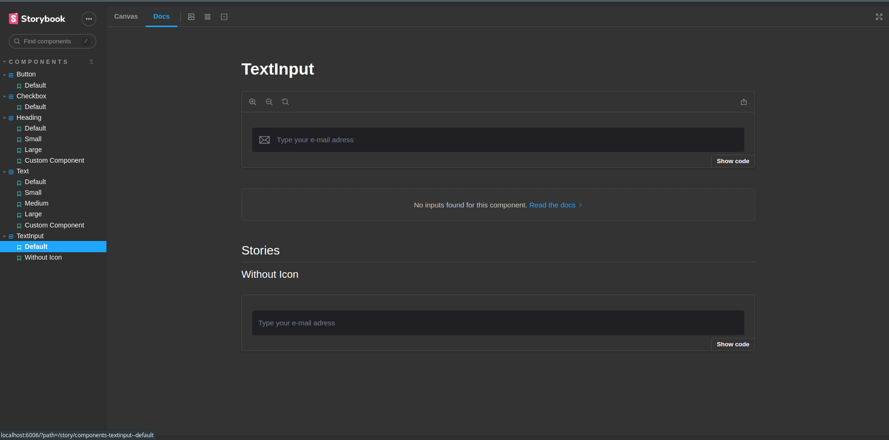

# Lab-Design-System

Praticando Desing de aplicação de ponta a ponta. 
Aplicação utilizando Figma, TypeScript, Storybook e outras dependencias como tailwind e radix!

## :heavy_check_mark: Resultado: https://lab-design-system-one.vercel.app/

   

   
   
   
   

   
   
   

